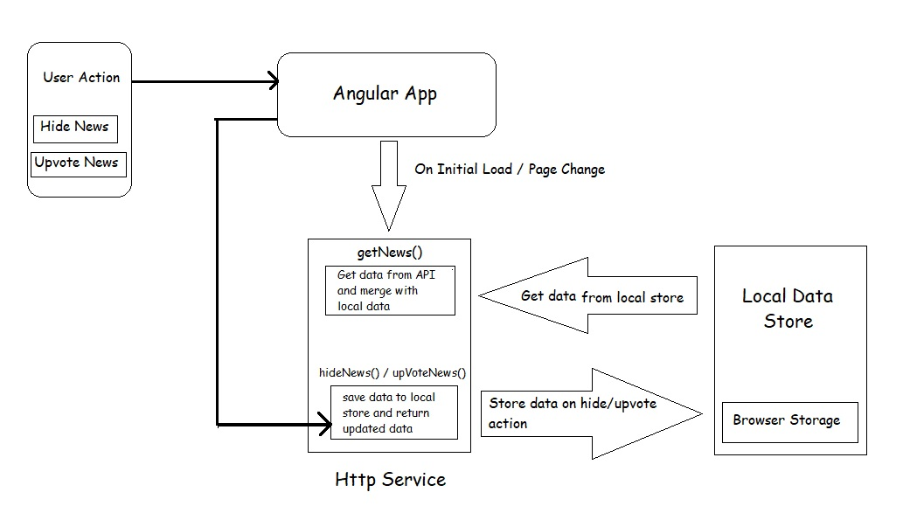

# Hacker News

Demo: [ng-hacker-news](https://ng-hacker-news.herokuapp.com)

This project was generated with [Angular CLI](https://github.com/angular/angular-cli) version 9.1.3.

## Development server

Run `npm run start` for a dev server. Navigate to `http://localhost:4200/`. The app will automatically reload if you change any of the source files.

Run `npm run dev:ssr` for running universal app.

## Code scaffolding

Run `npm run ng generate component component-name` to generate a new component. You can also use `ng generate directive|pipe|service|class|guard|interface|enum|module`.

## Build

Run `npm run build` to build the project. The build artifacts will be stored in the `dist/hacker-news/browser` directory. Use the `--prod` flag for a production build.

Run `npm run build:ssr` to build the universal project. The build artifacts will be stored in the `dist/hacker-news/server` directory.

Run `npm run serve:ssr` to start universal app server.

## Running unit tests

Run `npm run test` to execute the unit tests via [Karma](https://karma-runner.github.io).

## Running end-to-end tests

Run `npm run e2e` to execute the end-to-end tests via [Protractor](http://www.protractortest.org/).

## Further help

To get more help on the Angular CLI use `ng help` or go check out the [Angular CLI README](https://github.com/angular/angular-cli/blob/master/README.md).
